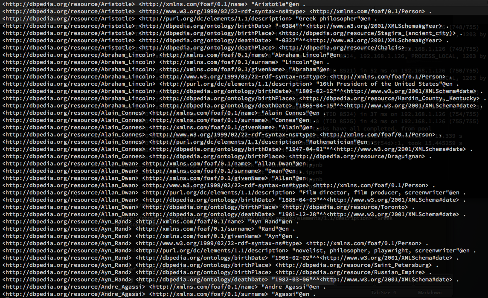

# Data pipelining with Spark

### Matt Aldridge


Research Software Engineer

Data Scientist

Professional Computer Geek

===

## The Unglamorous Truth

Working with data means spending a lot of time transforming and cleansing data

===

Data transforms are the new compiling


===

Data exploration and prototyping need rapid iterations

===

## Overcoming transform latency

Sampling is often useful

===

## Overcoming transform latency

Record based data transformations can be embarassingly parallel

Take advantage of it

===

## Spark

* A cluster computing framework, but also easy to use in local standalone mode
* Map/reduce as well as higher abstractions
* Manages job scheduling
* Spills large working datasets to disk
* Scala + Java + Python
* [spark.apache.org](http://spark.apache.org/)

===

## Resilient Distributed Dataset (RDD)

* Spark's main programming abstraction
* RDDs represent a collection of items distributed across many compute nodes that can be manipulated in parallel

===

## Resilient Distributed Dataset (RDD)

* Pull data from any Hadoop-accessible data source (including local files)
* Can contain almost any data type (must be serializable)
* Excels with (key, value) pairs
* Immutable data structure
  - Any change produces new RDD
  - Define RDD pipelines
  - Lazy execution

===

## One environment

Sparks feature set meets needs early and late in data dev cycle

Use the same pipelines early for data explation as later for scale

===

## Motivating Example

===

## DBpedia

> a crowd-sourced community effort to extract structured information from Wikipedia and make this information available on the Web

[dbpedia.org](http://dbpedia.org/)

===

## DBpedia

Data represented as RDF

(subject, predicate, object)

---

`<http://dbpedia.org/resource/Aristotle> <http://xmlns.com/foaf/0.1/name> "Aristotle"@en .`

---

`<http://dbpedia.org/resource/Aristotle> <http://purl.org/dc/elements/1.1/description> "Greek philosopher"@en .`

===



7.9M lines of this. Let's make it easier to slice-n-dice.

===

## Code!

```
URI_PREFIXES = [('http://dbpedia.org/resource/', 'wiki:'),
                ('http://xmlns.com/foaf/0.1/', 'foaf:'),
                ('http://dbpedia.org/ontology/', 'dbpedia:'),
                ('http://purl.org/dc/elements/1.1/', 'dc:'),
                ('http://www.w3.org/1999/02/22-rdf-syntax-ns#', 'rdf:')]

def shorten_url(url):
    """Use URL prefix shorthand."""
    for full, prefix in URI_PREFIXES:
        if url.startswith(full):
            return re.sub(full, prefix, url, count=1)
    return url
```

```
>>> shorten_url('http://dbpedia.org/resource/Aristotle')
'wiki:Aristotle'
```

===

### Code!

```
def simple_nt2spo(nt):
    """Parse nt string into (subj, prop, obj) tuple."""
    def parse(elem):
        if elem.startswith('<'):
            return shorten_url(elem.strip('<>'))
        else:
            return elem

    match_pat = r"(<.+>) (<.+>) (.+) \."
    match_obj = re.match(match_pat, nt)
    if match_obj:
        s, p, o = map(parse, match_obj.groups())
        return s, p, o
    else:
        return None
```

```
>>> simple_nt2spo('<http://dbpedia.org/resource/Abraham_Lincoln> <http://xmlns.com/foaf/0.1/surname> "Lincoln"@en .')
('wiki:Abraham_Lincoln', 'foaf:surname', '"Lincoln"@en')
```

===

### Code!

```
def simple_nt2kv(nt):
    """Parse nt string into (subj, {prop: obj}) key-value pair."""
    spo = simple_nt2spo(nt)
    if spo:
        s, p, o = spo
        return s, {p: o}
    else:
        return None
```

```
>>> simple_nt2kv('<http://dbpedia.org/resource/Abraham_Lincoln> <http://xmlns.com/foaf/0.1/surname> "Lincoln"@en .')
('wiki:Abraham_Lincoln', {'foaf:surname': '"Lincoln"@en'})
```

===

### Code!

```
def fold_dict(a, b):
    """Fold dict b into dict a."""
    a.update(b)
    return a
```

```
>>> fold_dict({'foaf:surname': '"Lincoln"@en'}, {'foaf:givenName': '"Abraham"@en'})
{'foaf:givenName': '"Abraham"@en', 'foaf:surname': '"Lincoln"@en'}
```

===

## Assembling the pieces

```
# (person, properties)
# RDD[str, dict]
persondata = spark_context.textFile('/data/dbpedia/persondata_en.nt') \
    .map(simple_nt2kv) \     # Create (subject, {prop: obj}) tuples
    .filter(lambda x: x) \   # Filter empty rows
    .reduceByKey(fold_dict)  # Combine each subject's {prop: obj} dicts
```

```
>>> persondata.count()
1121413
>>> persondata.take(1)
[(u'wiki:Boris_Spremo',
  {u'dbpedia:birthDate': u'"1935-10-25"^^<http://www.w3.org/2001/XMLSchema#date>',
   u'dbpedia:birthPlace': u'wiki:Susak',
   u'dc:description': u'"Canadian photojournalist"@en',
   u'foaf:givenName': u'"Boris"@en',
   u'foaf:name': u'"Boris Spremo"@en',
   u'foaf:surname': u'"Spremo"@en',
   u'rdf:type': u'foaf:Person'})]
```

===

## Slice-n-dice

```
def after_1900((person, props)):
	return props.get('dbpedia:birthDate') > '"1900'

persons_after_1900 = persondata.filter(after_1900)
```

```
>>> persons_after_1900.count()
700771
```

===

### Slice-n-dice

```
import pandas as pd

def get_description((person, props)):
	return props.get('dc:description')

descriptions = persondata.map(get_description).filter(lambda x: x)

description_counts = pd.Series(dict(descriptions.countByValue().items()))
description_counts.sort(ascending=False)
```

```
>>> description_counts
"American politician"@en           29797
"Footballer"@en                    23833
"American baseball player"@en      13283
"Canadian politician"@en           13235
"American musician"@en             13098
"American football player"@en      12940
"American actor"@en                12123
...
```

===

### Slice-n-dice

```
def select_living_politicians(row):
    url, props = row
    if ('American politician' in props.get('dc:description', '')
            and not 'dbpedia:deathDate' in props):
        return True
    return False

politicians = persondata.filter(select_living_politicians)
```

===

## Add linked data

Wikipedia is a graph. DBpedia provides a file with wiki's internal pagelinks.

`wiki:Axiom dbpedia:wikiPageWikiLink wiki:Theorem`

===

### Add linked data

```
# (page_from, page_to)
# RDD[str, str]
all_to_all_links = spark_context.textFile('/data/dbpedia/page_links_en.nt') \
    .map(simple_nt2spo) \
    .map(lambda spo: (spo[0], spo[2]) if spo else None) \
    .filter(lambda x: x)
```

===

### Add linked data

```
# Contains (person, None) for each person. Useful for joining with
# pagelinks as a filter on those.
# RDD[str, None]
person_dummy_pairs = persondata.map(lambda (k, v): (k, None))

# Inner join with person_dummy_pairs and extract pagelinks. The result
# is an RDD of (page_from, page_to) where every page_from is a person
# RDD[str, str]
person_to_all_links = all_to_all_links.join(person_dummy_pairs) \
	.map(lambda (k, v): (k, v[0]))

# Flip pagelink tuples, select only those that link to a person, and
# flip back so that it's (person_from, person_to)
# RDD[str, str]
person_to_person_links = person_to_all_links.map(lambda (k, v): (v, k)) \
    .join(person_dummy_pairs) \
    .map(lambda (k, v): (v[0], k))
```

Certainly not the most efficient or intuitive method. Spark's GraphX component would be more suitable, but it currently lacks a Python API.

===

## Build a graph
### ("Living US politicians")

```
import networkx as nx

polit_urls = set(politicians.keys().collect())

def polit_link_filter((link_from, link_to)):
	return link_from in polit_urls and link_to in polit_urls

polit_links = person_to_person_links.filter(polit_link_filter)

g = nx.DiGraph()
g.add_nodes_from(polit_urls)
g.add_edges_from(polit_links.collect())
```

===

## Pagerank

```
pr = pd.Series(nx.pagerank(g))
pr.sort(ascending=False)
```

```
>>> pr[:10]
wiki:Barack_Obama        0.014427
wiki:Mitt_Romney         0.004372
wiki:Paul_Ryan           0.002280
wiki:Bob_Dole            0.002093
wiki:Tim_Kaine           0.002047
wiki:Alan_Keyes          0.001991
wiki:Dianne_Feinstein    0.001976
wiki:Leon_Panetta        0.001789
wiki:Tom_Carper          0.001739
wiki:Harry_Reid          0.001636
```

===

## Build a Gephi GEXF export file

```
obama_graph = nx.ego_graph(g, 'wiki:Barack_Obama', undirected=True)
min_pr, max_pr = pr.min(), pr.max()
min_sz, max_sz = 30, 40

def proj_size(v):
    return (v-min_pr)/(max_pr-min_pr) * (max_sz-min_sz) + min_sz

sizes = {url: {'size': proj_size(pr[url])}
         for url in pr.index if url in obama_graph}
nx.set_node_attributes(obama_graph, 'viz', sizes)

nx.write_gexf(obama_graph, '/data/dbpedia/obama.gexf')
```

===

## Viz!

